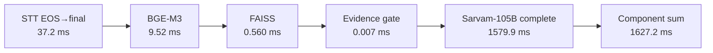

# Latency optimization summary

## Measurement scope

All new numbers are **ABLATION** measurements. They are not FORMAL VOICE E2E results. STT uses one pre-existing 12.696 s real-human smoke clip with three repeats; generation uses the first four development answerable cases. Historical reviewed generation quality remains separate.

The frozen baseline was not modified. No sealed data was used and no synthetic audio or synthetic metrics were used.

## Live capability audit

- Account probe: `sarvam-105b` returned HTTP 200; `sarvam-30b` returned HTTP 400 `invalid_request_error`. No other provider API key is configured.
- The frozen generator already sends `reasoning_effort=None`; the requested existing vs None comparison is therefore an identity, not a separate architecture.
- Sarvam documents the GA WebSocket VAD frame controls and notes that the newer realtime beta supersedes it for true partial transcripts: https://docs.sarvam.ai/api/api-guides-tutorials/speech-to-text/streaming-api
- Current model catalog: https://docs.sarvam.ai/api/getting-started/models

## Quality-preserving P50 waterfall

This is a component-sum diagnostic, not a synchronized E2E percentile:

| Bottleneck rank | Stage | P50 (ms) | Share of component sum |
| ---: | --- | ---: | ---: |
| 1 | Generation | 1579.879 | 97.1% |
| 2 | STT EOS→final | 37.219 | 2.3% |
| 3 | Embedding | 9.519 | 0.6% |
| 4 | FAISS | 0.560 | 0.0% |
| 5 | Evidence guardrail | 0.007 | 0.0% |

## STT ablation

| Configuration | n/success | Connection P50 | EOS→final P50 | Wall P50 | Note |
| --- | ---: | ---: | ---: | ---: | --- |
| rest_new_connection | 3/3 | 81.0 | 888.2 | 888.2 | latency-only; quality reference unavailable |
| rest_persistent_cold | 1/1 | 69.1 | 1074.9 | 1074.9 | latency-only; quality reference unavailable |
| rest_persistent_warm | 2/2 | n/a | 695.5 | 695.5 | latency-only; quality reference unavailable |
| websocket_buffered_preopened | 3/3 | 178.9 | 2337.5 | 3168.5 | latency-only; quality reference unavailable |
| websocket_live_stream_preopened | 3/3 | 211.2 | 37.2 | 13467.3 | latency-only; quality reference unavailable |
| websocket_live_stream_persistent | 1/0 | n/a | n/a | n/a | connection timeout; no winner claim |
| vad_current | 3/3 | 208.3 | 0.0 | 15366.8 | latency-only; quality reference unavailable |
| vad_aggressive | 3/3 | 191.5 | 367.6 | 14883.9 | latency-only; quality reference unavailable |
| vad_minimum_practical | 3/3 | 260.4 | 48.9 | 14350.1 | latency-only; quality reference unavailable |

Speaking duration is deliberately excluded from avoidable compute. For paced streaming, wall time includes the 12.696 s utterance; EOS→final is the decision metric.

## Generation ablation

| Configuration | n | Fail | TTFT P50 | Full P50 | Tokens in/out | Quality proxy |
| --- | ---: | ---: | ---: | ---: | ---: | --- |
| reasoning_none_current | 4 | 1 | 346.3 | 797.3 | 1918/70 | F1 0.467, ground 100.0% |
| reasoning_provider_default | 4 | 4 | n/a | n/a | n/a/n/a | F1 n/a, ground n/a |
| max_tokens_128 | 4 | 0 | 252.1 | 879.8 | 1893/68 | F1 0.467, ground 100.0% |
| max_tokens_64 | 4 | 1 | 237.9 | 854.6 | 1847/60 | F1 0.489, ground 100.0% |
| max_tokens_32 | 4 | 4 | n/a | n/a | n/a/n/a | F1 n/a, ground n/a |
| non_streaming | 4 | 0 | n/a | 1236.0 | 1899/68 | F1 0.625, ground 100.0% |
| persistent_http | 4 | 0 | 504.7 | 2053.5 | 1893/70 | F1 0.625, ground 100.0% |
| context_top5 | 4 | 0 | 254.3 | 1227.0 | 1088/86 | F1 0.217, ground 100.0% |
| context_top3 | 4 | 0 | 205.6 | 1044.7 | 705/79 | F1 0.133, ground 100.0% |
| compressed_top5 | 4 | 0 | 228.5 | 910.6 | 701/60 | F1 0.191, ground 100.0% |
| model_probe_sarvam-30b | 1 | 1 | n/a | n/a | n/a/n/a | F1 n/a, ground n/a |

Historical frozen strict-context run (12 cases, reviewed C/R/F): P50/P70/P95/P100 = 1580/1966/7009/11849 ms; C/R/F = 4.67/4.67/5.00.

## Fast-path ablation

| Configuration | Completion | Extractive | Fallback | Answer P50 | Citation valid | Grounded |
| --- | ---: | ---: | ---: | ---: | ---: | ---: |
| current_generative_rag | 100.0% | 0.0% | 100.0% | 1579.879 | n/a | 100.0% |
| extractive_high_confidence | 8.3% | 8.3% | 0.0% | 0.089 | 100.0% | 100.0% |
| hybrid_router | 100.0% | 8.3% | 91.7% | 1353.623 | 100.0% | 100.0% |

## Optimization table

Totals are P50 component sums, not synchronized E2E percentiles.

| Configuration | STT P50 | Embed | Search | Generation/answer P50 | Total P50 | Quality | <200 ms? |
| --- | ---: | ---: | ---: | ---: | ---: | --- | --- |
| reasoning_none_current | 37.2 | 9.52 | 0.560 | 797.3 | 844.6 | proxy; failures 1/4 | no |
| reasoning_provider_default | 37.2 | 9.52 | 0.560 | n/a | n/a | proxy; failures 4/4 | no |
| max_tokens_128 | 37.2 | 9.52 | 0.560 | 879.8 | 927.1 | proxy; failures 0/4 | no |
| max_tokens_64 | 37.2 | 9.52 | 0.560 | 854.6 | 901.9 | proxy; failures 1/4 | no |
| max_tokens_32 | 37.2 | 9.52 | 0.560 | n/a | n/a | proxy; failures 4/4 | no |
| non_streaming | 37.2 | 9.52 | 0.560 | 1236.0 | 1283.3 | proxy; failures 0/4 | no |
| persistent_http | 37.2 | 9.52 | 0.560 | 2053.5 | 2100.8 | proxy; failures 0/4 | no |
| context_top5 | 37.2 | 9.52 | 0.560 | 1227.0 | 1274.3 | proxy; failures 0/4 | no |
| context_top3 | 37.2 | 9.52 | 0.560 | 1044.7 | 1092.0 | proxy; failures 0/4 | no |
| compressed_top5 | 37.2 | 9.52 | 0.560 | 910.6 | 957.9 | proxy; failures 0/4 | no |
| model_probe_sarvam-30b | 37.2 | 9.52 | 0.560 | n/a | n/a | proxy; failures 1/1 | no |
| STT rest_new_connection + frozen generator | 888.2 | 9.52 | 0.560 | 1579.9 | 2478.2 | STT quality unscored | no |
| STT rest_persistent_cold + frozen generator | 1074.9 | 9.52 | 0.560 | 1579.9 | 2664.9 | STT quality unscored | no |
| STT rest_persistent_warm + frozen generator | 695.5 | 9.52 | 0.560 | 1579.9 | 2285.5 | STT quality unscored | no |
| STT websocket_buffered_preopened + frozen generator | 2337.5 | 9.52 | 0.560 | 1579.9 | 3927.5 | STT quality unscored | no |
| STT websocket_live_stream_preopened + frozen generator | 37.2 | 9.52 | 0.560 | 1579.9 | 1627.2 | STT quality unscored | no |
| STT websocket_live_stream_persistent + frozen generator | n/a | 9.52 | 0.560 | 1579.9 | n/a | measured failure | no |
| STT vad_current + frozen generator | 0.0 | 9.52 | 0.560 | 1579.9 | 1590.0 | STT quality unscored | no |
| STT vad_aggressive + frozen generator | 367.6 | 9.52 | 0.560 | 1579.9 | 1957.5 | STT quality unscored | no |
| STT vad_minimum_practical + frozen generator | 48.9 | 9.52 | 0.560 | 1579.9 | 1638.8 | STT quality unscored | no |
| extractive_high_confidence | 37.2 | 9.52 | 0.560 | 0.089 | 47.4 | completion 8.3% | yes* |
| hybrid_router | 37.2 | 9.52 | 0.560 | 1353.623 | 1400.9 | completion 100.0% | no |

`yes*` means only the independently summed post-EOS component medians are below 200 ms; it is not a formal complete-pipeline compliance result.

## Decision

### A — Best quality

Keep frozen Top-10 + strict-context Sarvam-105B with reasoning disabled. Pre-open the STT WebSocket and stream during speech; pre-initialize BGE-M3/index and use HTTP pooling. This preserves the only fully reviewed quality result. Generation remains the bottleneck.

### B — Best latency/quality tradeoff

Use pre-opened live STT plus a conservative high-confidence extractive router, falling back to the frozen generator. At the 0.80 experimental threshold, only 1/12 cases routed extractively; that routed citation was valid and relevant. Coverage is too low to move the overall P50 materially, but the path is safe enough for further evaluation.

### C — Fastest possible

For high-confidence cases only, return the selected verbatim sentence with its parent citation. Its post-EOS component sum is below 200 ms, but it completed only 1/12 cases. It is not a complete replacement and must abstain/fallback for every uncertain query.

## Safe parallelization and prewarming

- Load BGE-M3 and the FAISS index at process startup; the measured cold initialization cost is startup-only, not a per-query dependency.
- Open the STT WebSocket before speech and stream audio while the user speaks. This is the only large overlap with user time supported by the dependency graph.
- Prewarm HTTP/TLS connections, but do not overlap embedding with STT finalization, retrieval with embedding, or generation with evidence gating; each consumes the prior stage's output.
- No lightweight local QA checkpoint was already configured. The measured fast path therefore uses deterministic verbatim sentence selection and adds no unmeasured model.

## <200 ms conclusion

**The quality-preserving complete Voice-RAG architecture did not meet <200 ms.** The best diagnostic component sum is ~1627 ms after EOS, with Sarvam-105B generation contributing 97.1%. Historical Sarvam-105B TTFT alone is above 200 ms at P50, so connection/context tweaks cannot make the normal generative path compliant. The only sub-200 ms observation is the narrow extractive path, which lacks full coverage and is not a measured complete E2E percentile.

## Limitations

- STT sample size is one real-human smoke clip × three repeats, without a trusted reference transcript; VAD transcript-quality differences cannot be approved.
- Generation optimization uses four development cases; new quality values are deterministic proxies, not C/R/F human scores.
- Component-sum totals add independently measured P50s and are not formal E2E percentiles.
- Persistent WebSocket reuse failed during this run and remains unvalidated.
- No formal claim is made until the 24 real recordings are available.
